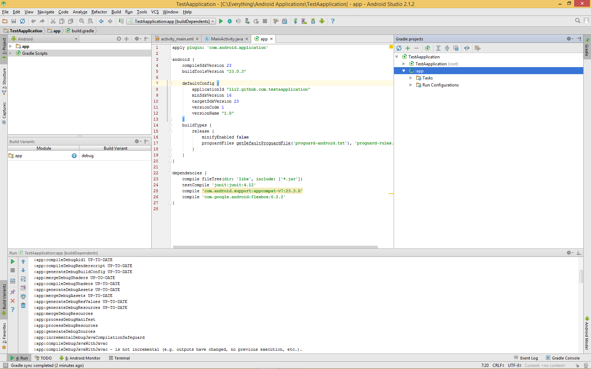

## Installation

#Android Studio

Open up the Gradle Window

Open the app config file ( :app -> Open Gradle config )

Add the following dependency to your `build.gradle` file:

```
dependencies {
    compile 'com.google.android:flexbox:0.2.2'
}
```

